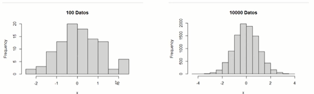

# Elementos de probabilidad y estadística - Parte 1

Este curso no incluye una introducción sistemática a los conceptos fundamentales de probabilidad y estadística. Te planteamos que si no te sientes cómodo con la parte práctica, busca información adicional en un texto formal de matemáticas o consultalo al profesor.
Si ya tienes formación formal en probabilidad y estadística, este repaso no es necesario.

## Observaciones

Antes de comenzar con los temas de probabilidad y estadística, es importante entender lo que significa una observación. En el contexto de la estadística, una observación es una medición o registro de una variable en un evento, objeto o individuo en particular. Por ejemplo, si se está estudiando la altura de las personas, una observación puede ser la altura de una persona en particular, medida en centímetros. Las observaciones pueden tomar diferentes formas, como valores numéricos, códigos o categorías, y pueden ser obtenidas mediante métodos como encuestas, experimentos o mediciones físicas.

## Tipos de variables

A su vez, las observaciones se dividen en distintas variables respecto a su tipo en cuantitativas y cualitativas.

### Variables cuantitativas

Las variables cuantitativas son aquellas que se miden en términos de cantidad o magnitud numérica, y se pueden dividir en dos subtipos: variables continuas y variables discretas.

- Las variables continuas pueden tomar cualquier valor en un intervalo específico, como la altura o el peso de una persona.
- Las variables discretas solo pueden tomar valores enteros, como el número de hijos que tiene una familia o la cantidad de estudiantes en una clase.

### Variables cualitativas

Las variables cualitativas, a diferencia, se miden en términos de características o atributos que no pueden ser expresados en términos numéricos. Las variables cualitativas se dividen en dos subtipos: variables nominales y variables ordinales.

- Las variables nominales se refieren a categorías sin un orden inherente, como el color de los ojos o la marca de un automóvil.
- Las variables ordinales, al contrario, tienen un orden inherente, como la escala de calificación de un examen (A, B, C, D, F) o la clasificación socioeconómica de las personas (alta, media, baja).

## Agrupando observaciones

Teniendo en cuenta que una observación es simplemente el registro de un evento o medición, ya sea una variable cuantitativa o cualitativa, podemos pasar a ver cómo éstas se organizan dentro del estudio estadístico. El conjunto de todas las observaciones existentes de una variable se denomina **universo** y representa el *conjunto completo* de datos de interés.

Es importante tener en cuenta que, en muchos casos, el universo puede ser *extremadamente grande o incluso infinito*, lo que dificulta medir o analizar todas las observaciones. Es por ello que se utilizan técnicas de muestreo para seleccionar un subconjunto representativo de observaciones del universo.

A lo largo del curso utilizaremos múltiples **datasets**, que no son más que un grupo de observaciones estructuradas y que analizaremos por medio de distintos medios y herramientas. De estos datasets se utilizarán **muestras**, que son una selección aleatoria o sistemática del universo de observaciones y que utilizaremos para hacer inferencias.

|    Tipos    |    Ejemplo    |    Explicación    |
|:-----------:|:-----------:|:-----------:|
|    Observación    |  |    Una observación singular    |
|    Universo    |  |    El conjunto de _todas_ las observaciones posibles, conforman el *universo*    |
|    Muestra    |  |    Un conjunto extraído u obtenido del universo que puede o no ser representativo del mismo    |

## Tipos de estadística

La estadística es una rama de las matemáticas que se encarga de recolectar, analizar e interpretar datos. Su objetivo principal es el de obtener información útil a partir de los datos. En general, la estadística se divide en dos grandes áreas: estadística descriptiva y estadística inferencial.

### Descriptiva

>_Conozco el universo y quiero describirlo mediante medidas que lo resuman_

Es la que se encarga de recopilar, organizar, resumir, analizar y presentar los datos obtenidos de una muestra. Explora y describe los datos de manera que se puedan interpretar.

### Inferencial

>_Conozco una muestra y quiero inferir el universo_

En algunos casos, la estadística descriptiva por sí sola no es suficiente para obtener las conclusiones que buscamos. En estos casos se puede utilizar la estadística inferencial, es la que se encarga de tomar conclusiones a partir de las muestras. Se utiliza para hacer predicciones sobre los datos a partir de los resultados obtenidos en la muestra.

## Probabilidad

En este curso utilizaremos multiples algoritmos, herramientas y métodos que nos permitirán realizar aproximaciones e información con el uso de la probabilidad, pero primero definamos de que se trata.

La probabilidad se encarga de estudiar y medir la posibilidad de que un evento o suceso determinado ocurra y sus posibles resultados. En otras palabras, la probabilidad se utiliza para cuantificar la incertidumbre en una situación que involucra varios resultados posibles.

Se representa numéricamente en una escala del 0 al 1, donde 0 indica que el evento es imposible de suceder y 1 indica que es seguro que ocurra. Todos los otros valores en el intervalo entre 0 y 1 indican diferentes grados de probabilidad, donde valores más cercanos a 1 indican una probabilidad más alta.

## Medidas 

Volviendo a la estadística, dentro de esta existen las diferentes medidas que resumen las observaciones en un conjunto que simplifica los datos. Por ejemplo, las medidas de altura de una clase pueden ser promedio, mediana, moda, mínimo y máximo. De esta manera, se puede tener una representación más simple de los datos que permita una mayor comprensión y análisis.
Aquí se explica brevemente algunas de ellas:

- **Media**: También conocida como promedio, es el valor obtenido al sumar todos los datos y dividir el resultado entre el número total de datos. Suele utilizarse como el valor mas representativo, aunque no debe abusar de su uso porque este valor puede diferir de la realidad. 
- **Mediana**: El valor que ocupa el punto medio de un conjunto de datos, el centro de los valores ordenados de menor a mayor. Suele utilizarse cuando valores extremos afectan a la media.
- **Moda**: Es el valor que aparece con mas frecuencia en el conjunto de datos e indica el valor mas típico o común en el conjunto.
- **Desvío estándar**: Es una medida de variabilidad, es decir, de cuán dispersos están los datos de una muestra de una población respecto a la media.
- **Percentiles**: Son medidas que dividen un conjunto de datos en 100 partes iguales. El percentil 50 es la mediana, el percentil 25 es el valor que separa el 25% inferior de los datos, y el percentil 75 es el valor que separa el 75% inferior de los datos.

## Gráficos

Los gráficos son herramientas visuales que se utilizan para representar los datos de manera clara y comprensible, existen múltiples tipos de gráficos orientados a distintos tipos de datos y representaciones, a continuación se explicará brevemente algunos de ellos:

- **Barras**: Utiliza los ejer cartesianos (X, Y) para representar datos discretos o categóricos, donde en alguno de los ejes se posicionan las categorías de la variable mientras que su altura o longitud representa la frecuencia de esa categoría.
- **Líneas**: Muestra la evolución de una o varias variables numéricas en el tiempo o en un eje cartesiano. Los puntos de datos están conectados por segmentos de línea recta para mostrar la tendencia o el patrón de cambio en los datos.
- **Torta**: Se trata de un círculo dividido en sectores que representan cada uno una proporción del total, la suma de los sectores es igual al 100%.

>Los gráficos circulares son muy criticados y deben evitarse en la medida de lo posible.

- **Histograma**: Representa la distribución de los datos por medio de columnas que muestran la frecuencia de los datos, es decir, el número de veces que aparece un valor. Es útil para detectar patrones mediante la distribución.

>A cuantos mas datos, mejor la representación gráfica.

- **Diagrama de dispersión**: Muestra la relación entre 2 variables numéricas. Donde cada punto de datos representa una observación de ambas variables, el valor de su primera variable se representa en el eje X, el de la segunda en el eje Y.
- **Boxplot**: Ofrece un resumen de una o varias variables numéricas. La línea que divide la caja en 2 partes representa la mediana de los datos. El final del recuadro muestra los cuartiles superior e inferior. Las líneas extremas muestran el valor más alto y el más bajo excluyendo los valores atípicos.

Existe multiplicidad de distintos gráficos disponibles, cada uno de ellos con sus particularidades y ventajas, te dejamos links a continuación para que puedas continuar indagando en ello.

<a href="https://www.data-to-viz.com/" target="_blank">From data to viz</a>
 
<a href="https://r-graph-gallery.com/index.html" target="_blank">The R Graph Gallery</a>

Ya vimos que son las observaciones, sus tipos, como se agrupan y como a partir de éstas se puede realizar distintas medidas y gráficas. En el siguiente capítulo continuaremos conociendo más elementos y dar incapié a la rama inferencial de la estadística.
