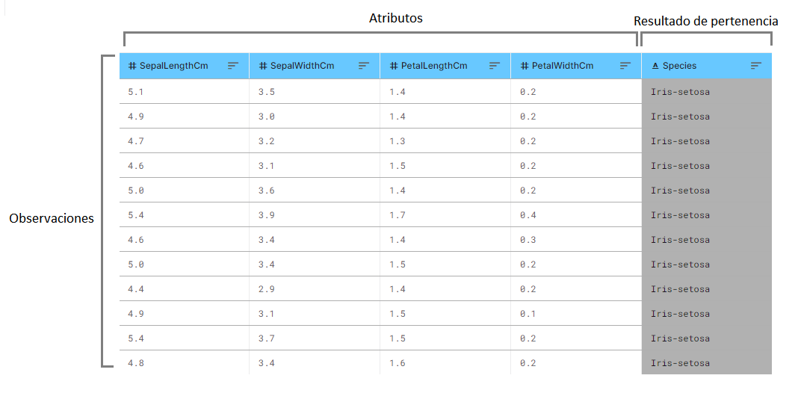
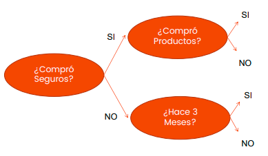
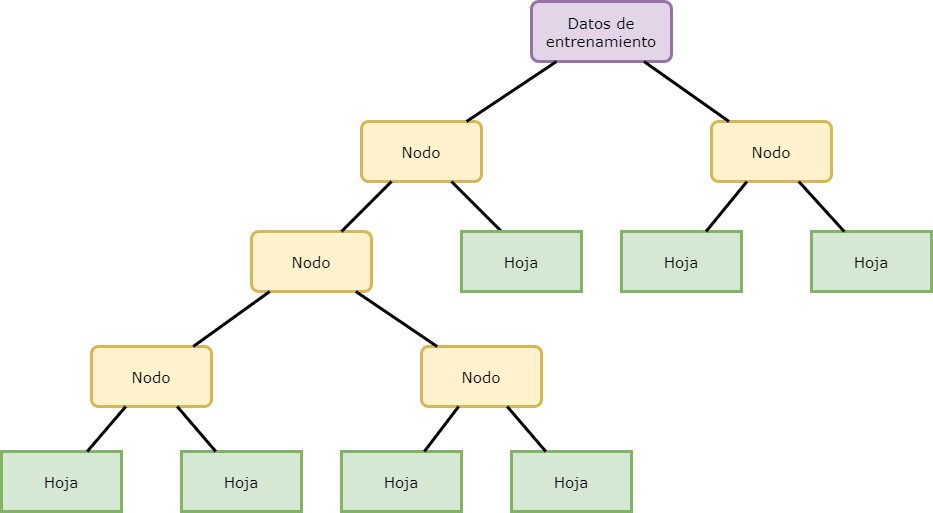

# Árboles de decisión

- ### Algoritmo:
	- *Categoría*: Machine Learning
	- *Aprendizaje*: Supervisado
	- *Objetivo*: Clasificación y/o regresión
		- *Entrada*: Variables categóricas o regresivas
		- *Salida*: Variables categóricas o regresivas

<div class="warning">
<p>Antes de comenzar con el estudio y práctica de algoritmos te recomendamos leer el capítulo de introducción a los algoritmos</p>
</div>

## ¿Que son?

Los árboles de decisión son una herramienta útil para detectar patrones y obtener conocimiento a partir de un conjunto de datos. El proceso consiste en tener un conjunto de datos de N observaciones que están definidas por M atributos, donde cada observación tiene un <u>resultado de pertenencia</u> (su etiqueta). El objetivo es *aprender a predecir* este resultado de pertenencia a partir de los atributos presentes.



>Este proceso de aprendizaje es supervisado, ya que para la construcción del árbol es necesario conocer la clase a la que pertenece cada observación.

Entonces podríamos decir que el algoritmo de árboles de decisión se basa en buscar las diferencias clave entre los datos utilizando sus atributos, y estos le permiten comprender bajo que circunstancias ocurre el patrón que se está buscando.

Para lograr esto, el algoritmo evalúa la división que genera cada atributo y decide cuál de ellos es el que mejor permite dividir los datos en subgrupos homogéneos o puros (que comparten características en común), este proceso se repite iterativamente utilizando los distintos atributos y generando así distintos niveles de subgrupos. En cada nivel del árbol, se usan métricas como la ganancia de información o la impureza del nodo para calcular la "pregunta óptima" (es decir evaluar el atributo óptimo) a fin de dividir los datos en grupos más pequeños. Este proceso se repite hasta que los datos se hayan dividido lo suficiente como para predecir un resultado o hasta llegar a una condición de corte.

<div class="info">
<p>Es un algoritmo muy noble, ya que permite tanto la entrada como salida de variables categóricas o regresivas, se lo puede utilizar como clasificador o como regresor , esto lo hace muy adaptable, ejecuta rápido y el resultado es legible por humanos</p>
</div>

## Partes del árbol

La construcción de árboles de decisión consiste en ir partiendo el conjunto de observaciones en forma sucesiva. Cada división la vamos a llamar **nodo**. Cuando un nodo no conduzca a nuevas divisiones se denomina **hoja**, pero hasta entonces estos nodos también son considerados como **ramas** del árbol (ya que conducen a distintos nodos del árbol)



## Partes del árbol

La construcción de árboles de decisión consiste en ir partiendo el conjunto de observaciones en forma sucesiva. Cada división la vamos a llamar **nodo**. Cuando un nodo no conduzca a nuevas divisiones se denomina **hoja**, pero hasta entonces estos nodos también son considerados como **ramas** del árbol (ya que conducen a distintos nodos del árbol)



## Las métricas de decisión

Para lograr evaluar los atributos y tomar decisiones el algoritmo realiza distintas métricas, este se plantea "preguntas" (es decir evalúa atributos) en cada uno de los niveles del árbol y aplica una división que asegure mayor pureza a cada nodo que crea. Algunas de las métricas que utiliza para este fin son:

### Ganancia de información

La ganancia de información es una métrica que mide cuanto aumenta el nivel de certeza luego de la división, es decir mide la diferencia de entropía antes y después de la división. Podemos pensar en la ganancia de información y a la entropía (aleatoriedad) como opuestos, donde si el nivel de entropía baja la ganancia de información o certeza aumenta.

### Impureza del nodo

La impureza del nodo es una métrica que mide la impureza de los datos en un nodo. Existen distintos tipos de impureza, como la entropía, el índice Gini o el error de clasificación. Cada uno de estos se mide de manera diferente aunque su objetivo es el mismo, medir que tan mezclados están los datos respecto a sus atributos.

## Usos del algoritmo

Una de las ventajas de los árboles de decisión es que son robustos ante la presencia de ruidos o errores en los conjuntos de entrenamiento, lo que los hace útiles en situaciones en las que los datos pueden no ser completamente precisos. Además, los árboles de decisión son una herramienta adaptable, de ejecución rápida y fáciles de interpretar por humanos, lo que los hace útiles en una amplia gama de aplicaciones, algunos ejemplos de sus usos son:

MEJORAR

| Uso                          | Explicación                                                                                                                                                                                                                                                                                                                                                |
| :----------------------------: |---------------------------------------------------------------------------------------------------------------------------------------------------------------------------------------------------------------------------------------------------------------------------------------------------------------------------------------------------------- |
| Generar reglas               | Cada sucesión de nodos conectados, desde la primera rama hasta el último nivel, pueden ser escritas como reglas. Esto permite interpretar y comunicar de manera sencilla los resultados obtenidos                                                                                                                                                          |
| Reducción de atributos       | Pueden usarse para reducir la cantidad de atributos involucrados en un problema predictivo. Esto gracias a las métricas de ganancia de información o la impureza del nodo, que permiten descartar los atributos con poca o ninguna información relevante. Esta reducción permite ahorrar tiempo y recursos computacionales, dando resultados más precisos. |
| Estimación de valores        | Al ser regresivo permite este tipo de usos                                                                                                                                                                                                                                                                                                                 |
| Estimación de probabilidades | Una vez entrenado el modelo podemos utilizarlo para estimar probabilidades|
| Agrupamiento                 | Los grupos que genera u "hojas" pueden ser utilizados como en algoritmos de agrupamiento                                                                                                                                                                                                                                                                   |

## Los algoritmos de árboles

Es importante aclarar que no existe un único algoritmo capaz de realizar árboles de decisión, existen diferentes métodos y librerías que nos permiten realizarlo, cada una con sus ventajas y desventajas asociadas, algunos de los algoritmos desarrollados mas difundidos son:

COMPLETAR

| Algoritmo            | Propiedades                                                                                                                       |
| -------------------- | --------------------------------------------------------------------------------------------------------------------------------- |
| Error esperado       | Es el algoritmo más simple y también el que peores resultados presenta de los que mencionamos aquí                                |
| CART (GINI)          |                                                                                                                                   |
| Ganancia de Entropía |                                                                                                                                   |
| C4.5                 | Es una variante de la ganancia de entropía, se comporta levemente mejor que este y que Gini (y mucho mejor que el error esperado) |
| DKM                  | Se comporta ligeramente mejor que C4.5                                                                                            |

## Poda y sobreajuste

En la explicación sobre los algoritmos de árboles de decisión explicamos que estos se continúan subdividiendo hasta lograr lo "suficiente como para predecir un resultado". Sin embargo, esto no siempre es así, de hecho, algunos algoritmos continúan subdividiéndose hasta que solo quedan hojas o hasta que ya no hay más atributos que utilizar. Pero, ¿realmente todas las subdivisiones son útiles para predecir?

Además, como se mencionó en la [introducción a los algoritmos], para trabajar con este algoritmo primero se debe construir los conjuntos de *entrenamiento* y *prueba*.

Es aquí donde se vuelve valioso haber utilizado estos conjuntos. Al comparar el árbol obtenido al utilizar el conjunto de entrenamiento con los datos de prueba, se pueden eliminar todas las subdivisiones que no cumplan con los estándares de calidad.

Estas subdivisiones que no aportan valor predictivo y no cumplen con los estándares de calidad se denominan sobreajuste. Es decir, se enfocan en cualidades casuales de la muestra que no representan el universo del que provienen. El proceso de eliminar estas subdivisiones se llama poda y se puede clasificar en:

- **Prepoda**: Se realiza durante la construcción del árbol y antes de que alcance la profundidad máxima. Cuando las subdivisiones posibles para un nodo no superan determinado factor de calidad entonces este nodo se considera una hoja y se detiene su división.
- **Postpoda**: Se realiza la división hasta el final y se eliminan desde el final todos los nodos o ramas que no aportan información relevante o que incluso pueden reducir la precisión del modelo. Esto se logra evaluando el valor de cada una de ellas en comparación a los datos de testeo y se elimina las que no mejoran el modelo.
- **Re-estructuración**: Cuando se trabaja con árboles de decisión, a veces puede ocurrir que el conjunto de casos no sea conocido desde el principio, sino que se van conociendo en el tiempo. En estos casos, puede ser conveniente empezar la división de una manera distinta a la que se hubiera hecho si se conociera todo el conjunto de antemano. Este proceso permite modificar la estructura del árbol a medida que se van obteniendo nuevos datos.

## Ejercicios

### Ejercicio 1

Para comenzar con los ejercicios utilizaremos la librería `rpart` que crea, a partír de un conjunto de datos, un árbol de decisión que puede utilizarse para pronosticar con la función `predict()`. Para ello primero descarga el dataset de la clase <a href="files/people.csv" descargar>Descarga el archivo aquí</a>

>El dataset que utilizaremos es una colección observaciones sobre la altura de personas, el objetivo del ejercicio es poder utilizar los atributos para aprender a predecir.

Una vez descargado el archivo procedemos a leerlo, utilizamos a función `read.csv` y lo almacenamos en una variable, a continuación veamos la estructura del dataset utilizando `str()`

```{r file_read_notEval, eval = FALSE}
# Cambiamos el path a la dirección en donde se encuentra nuestro archivo
read_csv <- read.csv("path/to/file.csv")
str(read_csv)
```

```{r file_read, echo = FALSE}
read_csv <- read.csv("files/people.csv")
str(read_csv)
```

El dataframe posee 1000 líneas y 4 variables, estas representan lo siguiente:

- a.padre: altura del padre
- a.madre: altura de la madre
- s.hijo: sexo del hijo
- a.hijo: altura del hijo

Entonces ya sabemos de que se trata el dataset, es una tabla que indica la altura de dos padres y el género y altura de su hijo, nuestro objetivo es ver la relación que existe entre estos valores.

Comenzamos por cambiar los valores de `s.hijo` de carácteres a factores

```{r}
read_csv$s.hijo <- as.factor(read_csv$s.hijo)
str(read_csv)
```


