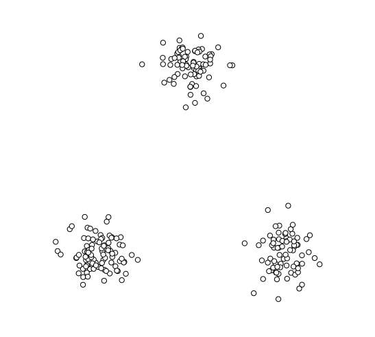
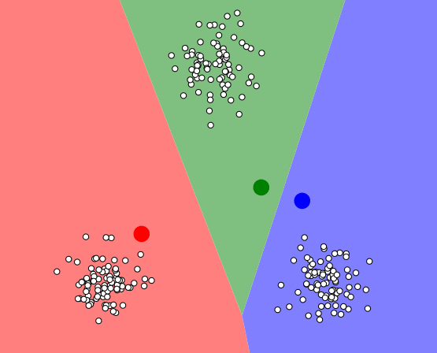
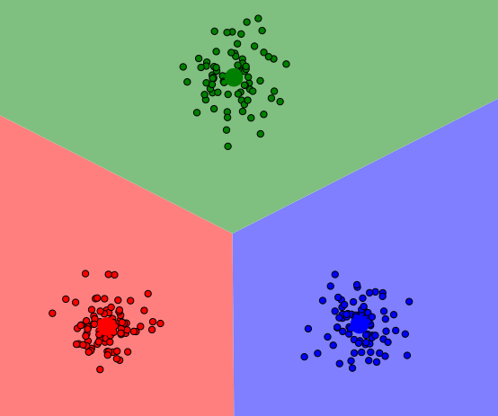

# Algoritmos de agrupamiento

- ### Algoritmo:
	- *Categoría*: Machine Learning
	- *Funcionamiento*: No supervisado
	- *Objetivo*: Agrupamiento
		- *Entrada*: Variables categóricas o regresivas
		- *Salida*: Conjuntos de grupos

Antes de comenzar con el estudio y práctica de algoritmos te recomendamos leer el capítulo de [introducción a los algoritmos]

## ¿Qué son?

Los algoritmos de agrupamiento, también conocidos como **clustering** en inglés, son técnicas que permiten agrupar un conjunto de puntos (observaciones) distribuidos en un espacio de varias dimensiones. Estos puntos son agrupados de acuerdo a criterios de proximidad, que pueden variar dependiendo de la métrica utilizada para definir dicha proximidad, algunas de las métricas más comunes son la euclídea y la matriz de correlación.

El objetivo de estas técnicas es obtener grupos de observaciones que compartan características o atributos similares y que, a su vez, estos grupos se diferencien entre sí. Los grupos obtenidos permiten describir e identificar patrones y estructuras del conjunto de datos complejo.

Es importante destacar que estas técnicas de clustering funcionan sin supervisión y <u>no poseen poder predictivo alguno</u>. Es decir, no buscan encontrar relaciones entre variables descriptivas y una variable objetivo (o etiqueta), sino que se enfocan en encontrar similitudes entre los datos sin tener una variable objetivo de referencia.

## Criterios de proximidad

Cuando se habla de criterios de proximidad en algoritmos de agrupamiento, se refiere a la medida en que los objetos del conjunto de datos están cerca entre sí. La proximidad se puede medir de diversas formas, y esto depende del tipo de datos que se esté analizando y del objetivo del análisis.

En el caso de datos que se pueden representar en un espacio dimensional, la proximidad física puede medirse mediante la distancia euclidiana, la cual mide la distancia entre dos puntos en un espacio de n dimensiones.

Sin embargo, en algunos casos, los atributos en común pueden ser una mejor medida de proximidad. Es decir, dos objetos pueden considerarse cercanos en función de su similitud en ciertas características, incluso si no están cerca físicamente en el espacio de características.

Podemos dividir los algoritmos de agrupamiento en dos grandes tipos, el agrupamiento jerárquico y el no jerárquico.

## Agrupamiento jerárquico

En el clustering jerárquico se apunta a agrupar los datos en forma de árbol (también conocido como dendrograma). Este árbol puede ser formado tanto por la aglomeración como la división de las observaciones.

### Aglomerativos (bottom up)

En este caso se comienza considerando a cada punto como un grupo separado y, en cada paso, los grupos más similares se fusionan hasta que se obtiene un solo grupo. El resultado final es una jerarquía de grupos en forma de árbol que pueden ser interpretados a diferentes niveles de agregación.

### De división (top down)

Este caso podría decirse que es el inverso, se comienza utilizando el conjunto entero de observaciones y se va subdividiendo hasta llegar a elementos individuales.

## Agrupamiento no jerárquico

En los agrupamientos no jerárquicos, el operador decide el número de divisiones. Se agrupan las observaciones según su cercanía, buscando grupos heterogéneos pero con elementos homogéneos en su interior. 

Aunque en ocasiones no son muy robustos en cuanto a los resultados que ofrecen, su uso está muy extendido, especialmente el método k-medias (o k-means).

### K-means

El objetivo de k-means es agrupar puntos de datos similares en un número de clústeres predefinido por el usuario. El proceso se realiza en varias iteraciones hasta que se llega a un punto donde los clusters se estabilizan y no cambian más.

El algoritmo funciona midiendo la distancia entre cada punto de datos en un espacio n-dimensional. Cuanto más cerca estén dos puntos de datos, más similares serán y cuanto más alejados, menos similares.

>Para ejemplificar el procedimiento utilizaremos un set de datos simple. Los datos se representan como círculos blancos ubicados en un espacio de dos dimensiones, también se discierne 3 grupos de datos distintos.

El algoritmo utiliza *centroides* que son simplemente un término para referirse al centro de un cluster. Por lo tanto, el número de centroides corresponderá al número de clusters que se creen.

En la primera iteración del algoritmo se colocan los centroides en posiciones aleatorias del espacio de datos. A partir de ahí cada punto de datos se asignará al centroide más cercano, lo que crea los grupos iniciales.

>Aquí se puede ver los centroides asignados en lugares aleatorios del espacio (Los círculos de mayor tamaño) y como los datos son asignados a un grupo al tomar el color del centroide.

En la siguiente fase, se calcula el centro del grupo y se mueven los centroides hacia allí. Tras moverse los centroides, se reasignarán los puntos de datos a los nuevos centroides más cercanos y se repite el proceso hasta que los centroides ya no se muevan y los grupos se estabilizan.

>Como se puede ver, los centroides se aproximaron a los diferentes grupos de datos

Estos gráficos fueron creados utilizando la herramienta de visualización de k-means de <a href="https://www.naftaliharris.com/blog/visualizing-k-means-clustering/" target="_blank"> NaftaliHarris</a>

