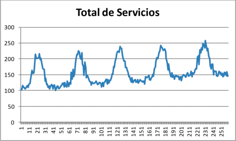

# Series temporales {#series_temporales}

- ### Algoritmo:
	- *Categoría*: Machine Learning
	- *Aprendizaje*: Supervisado
	- *Objetivo*: Predicción
		- *Entrada*: Variables ordenadas en el tiempo
		- *Salida*: Valores futuros - Predicción

Antes de comenzar con el estudio y práctica de algoritmos te recomendamos leer el capítulo de [introducción a los algoritmos]

## ¿Que son?

Una serie temporal es una colección de observaciones de una variable aleatoria tomadas en forma secuencial a medida que transcurre el tiempo.

Estas mediciones se utilizan para predecir cómo la variable se comportará en el futuro. Por lo tanto, se examina el comportamiento de la serie temporal en el pasado para inferir su comportamiento en el futuro.

En las series temporales, las observaciones sucesivas están relacionadas entre sí. Por lo tanto, el análisis *debe respetar el orden temporal en el que se producen las mediciones*. Esto significa que los métodos estadísticos que asumen la independencia de las observaciones *no son válidos* para el análisis de series temporales, ya que los valores en un momento en el tiempo dependen de los valores de la serie en el pasado.

El propósito del análisis de series temporales es describir la serie temporal y comprender cómo se comporta a lo largo del tiempo. Esto incluye examinar si la serie temporal presenta una **tendencia creciente**, si hay una **influencia estacional** o si hay **observaciones extrañas**. Esta información se puede utilizar para hacer predicciones sobre el comportamiento futuro de la serie temporal.

## Clasificaciones de las series temporales

Las series temporales se pueden clasificar en cuatro categorías principales: discretas, continuas y determinísticas, estocásticas.

### De acuerdo a la frecuencia de los datos:
- **Las series discretas**: Se toman valores de forma no constante, generalmente en intervalos regulares.
- **Las series continuas**: Tienen un valor para cada momento.

### De acuerdo a la forma de predicción:
- **Las series determinísticas**: Se pueden predecir con precisión.
- **Las series estocásticas**: Dependen de las observaciones pasadas, pero también de factores aleatorios, por lo que solo se pueden predecir de forma aproximada.

## Aspectos de una serie temporal

- **Tendencia**: Son aquellas que muestran un patrón general de aumento o disminución en el tiempo. Se refiere al comportamiento de la serie a largo plazo, generalmente con un promedio que toma en cuenta varios períodos.

>Gráfico con tendencia a subida

- **Estacionalidad**: Estas series muestran patrones periódicos, como el desempleo que aumenta en invierno y disminuye en verano. 

> Casos de gripe a través de los años, muestra una estacionalidad en los inviernos

- **Componente Aleatorio**: Es la parte restante de la serie temporal, y se puede tratar de capturar usando un modelo probabilístico para estimar los desvíos en las predicciones.

>Eventos aleatorios que definen el precio de Bitcoin

De estas tres componentes, las dos primeras, resultan determinísticas mientras que la tercera es estocástica.

## Predicción estocástica

Las series temporales estocásticas serán nuestro enfoque ya que son las que presentan mayor dificultad a la hora de establecer un modelo que permita predecir los valores futuros, para ello se utiliza el modelo ARIMA.

- **Enfoque ARIMA**: Supone que los datos de la serie temporal que se está intentando pronosticar provienen de *un proceso aleatorio o estocástico*. Esto significa encontrar **qué proceso generó los datos**, estimar los parámetros relevantes para ese proceso, verificar que las hipótesis sean válidas y luego usar el modelo para predecir el futuro con base en lo observado.

Para el caso, utilizaremos ARIMA habiendo previamente eliminado / suprimido los aspectos de tendencia y estacionalidad de la serie temporal. Para ello se utilizan distintas herramientas y estrategias.

### Des<u>diferencia</u>ción

Diferenciación de la serie se refiere a una técnica usada para intentar eliminar la **tendencia** de una serie temporal. Esto se logra restando el valor en el instante actual $t$ de su valor en el instante anterior, $t-1$. Esto genera una nueva serie cuyo comportamiento es más predecible y fácilmente analizable ya se ve menos afectada por la tendencia.
Luego, usando análisis de Fourier podemos encontrar el período que tiene sentido para nuestro problema y desestacionalizarla calculando los promedios a lo largo de toda la serie.

### Des<u>estacion</u>alización

Una vez que hemos identificado el período más largo relacionado con nuestro problema (Cada serie tendrá su periodicidad particular), *podemos **desestacionalizar** la serie original calculando el promedio a lo largo de toda la serie* (por ejemplo semanas).

>Se logra al dividir cada valor de la serie original por el promedio obtenido.

Esto nos da un mejor conocimiento sobre lo que está sucediendo en nuestra serie: como la oscilación anual, armónicos superiores, aumento lineal, etc.

