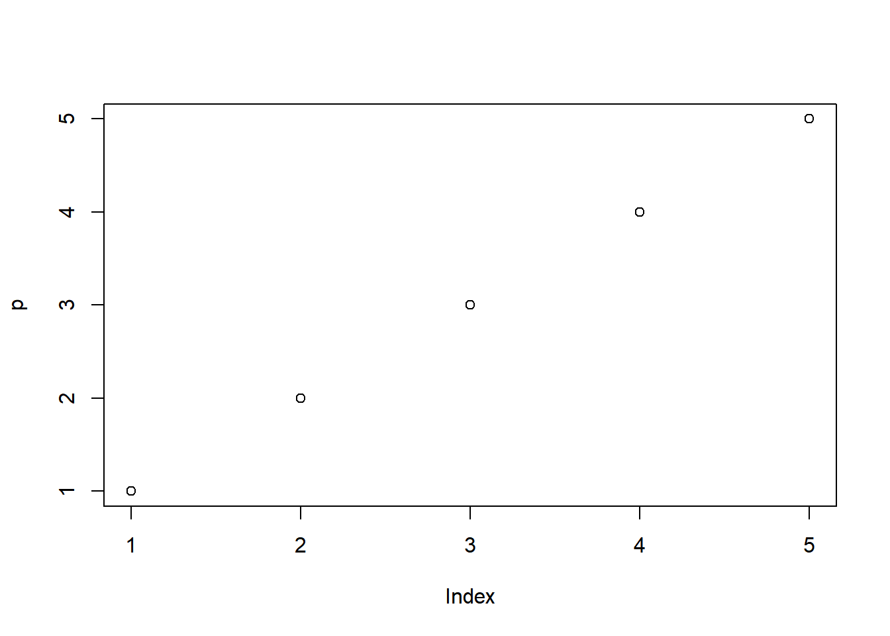

# Introducción a los algoritmos

Acá va ir la futura introducción a los temas (TODO)

## Prueba chunks

```r
paste("Sample", "text", 1, sep = " ")
```

```
## [1] "Sample text 1"
```

```r
p <- (1:5)
plot(p)
```


