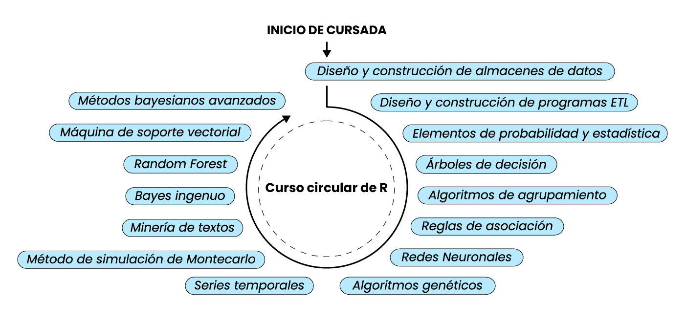

# Te damos la bienvenida

¡Bienvenida/o al *Curso Circular de R* para Data Analytics! Este material de estudio es un complemento escencial para las clases en vivo que se dictan como parte del curso.

En el panel izquierdo se encuentra detallada la *tabla de contenidos*, que enumera todos los temas que se cubren en el curso. Cada tema tiene su propia página, que contiene una explicación detallada del concepto y una serie de ejercicios prácticos.

## Curso circular

La estructura circular del curso te permite avanzar de manera flexible, no hay un inicio establecido para el curso, por lo que podes comenzar a aprender desde cualquier clase. ¡Pongamos un ejemplo! En la siguiente imagen se muestra como un alumno puede comenzar a estudiar desde dos puntos totalmente distintos, el alumno es el que elige cuando iniciar la cursada y con que tema.

>A pesar de que en este caso se refleja solo dos inicios, tu puedes comenzar desde donde quieras.

Sin embargo, se recomienda encarecidamente que si no posees conocimientos previos o necesitas repasarlos entonces leas los temas de [introducción a los algoritmos] y <a href="elementos-de-probabilidad-y-estad%C3%ADstica---parte-1.html">Elementos de probabilidad y estadística</a> antes de profundizar en los temas más avanzados.

Sin más que decir, solo queremos recordarte que si te surgen dudas o inconvenientes no olvides consultar a los profesores.
